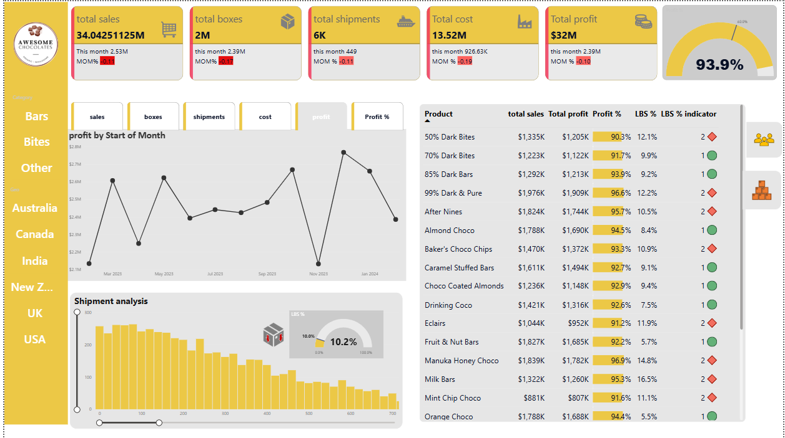

Sales Analytics Dashboard
Awesome Chocolates — Power BI Sales Dashboard
A complete end-to-end sales analytics report built in Power BI Desktop
Tracking revenue, profitability, shipments, and salesperson performance across 6 countries.

Screenshot:


📌 Project Overview
This Power BI project delivers a single-page executive dashboard for Awesome Chocolates — a multi-country chocolate brand. It gives sales managers a real-time view of performance across products, regions, and salespeople, with full month-over-month trend analysis.

Key business questions answered:

Are we hitting our 60% profit margin target?
Which products are most and least profitable?
Where are low-box shipments (< 50 boxes) dragging down efficiency?
How did this month compare to last month across every KPI?


📊 Dashboard Highlights
VisualDescription💰 5 KPI CardsTotal Sales · Boxes · Shipments · Cost · Profit — each with This Month value and MOM% badge🎯 Profit GaugeRadial gauge showing overall profit % vs the 60% target threshold📈 Profit by MonthLine chart tracing monthly profit from Mar 2023 → Jan 2024📦 Shipment HistogramDistribution of shipments by box count with scrollable range slider🔢 LBS% GaugeTracks the % of low box shipments (target: keep below 10%)📋 Product TableFull product list with Sales, Profit, Profit%, LBS%, and RAG indicator
Dynamic Measure Switcher
The chart panel supports switching between 6 metrics using a slicer:
Sales · Boxes · Shipments · Cost · Profit · Profit %


🧩 Data Model
The report is built on a clean star schema:
                    ┌─────────────┐
                    │  calendar   │  ← Date dimension
                    └──────┬──────┘
                           │
     ┌─────────────┐  ┌────▼──────────┐  ┌──────────────┐
     │  products   ├──►  shipments    ◄──┤  locations   │
     │  (Product)  │  │  (Fact Table) │  │  (Geography) │
     └─────────────┘  └──────┬────────┘  └──────────────┘
                             │
                      ┌──────▼──────┐
                      │   people    │  ← Salesperson dimension
                      └─────────────┘
TableTypeKey ColumnsshipmentsFactSales, Boxes, Cost, Date, Product, Geography, Sales PersoncalendarDimensionDate, Year, Month, Start of MonthproductsDimensionProduct, Category, Cost per boxpeopleDimensionSales person, TeamlocationsDimensionGeo, RegionMeasure SelectorHelperDisconnected slicer for dynamic metric switching
📄 Full schema → docs/data-model.md

📐 DAX Measures Reference
<details>
<summary><strong>Core Aggregations</strong></summary>
```dax
total sales    = SUM(shipments[Sales])
total boxes    = SUM(shipments[Boxes])
total shipments = COUNTROWS(shipments)
Total cost     = SUM(shipments[Cost])
Total profit   = [total sales] - [total boxes]
Profit %       = DIVIDE([Total profit], [total sales])
```
</details>
<details>
<summary><strong>LBS (Low Box Shipments)</strong></summary>
```dax
LBS count = CALCULATE([total shipments], shipments[Boxes] < 50)
LBS %     = DIVIDE([LBS count], [total shipments])
-- Indicator: 0 = good, 1 = warning, 2 = critical
LBS % indicator =
IF([LBS %] > [LBS down target], 2,
IF([LBS %] > 0.05 * [LBS down target], 1, 0))
</details>

<details>
<summary><strong>Month-over-Month % Changes</strong></summary>
```dax
MOM Sales change % =
    VAR this_month = [total sales]
    VAR prev_month = [total sales(prevs month)]
    RETURN DIVIDE(this_month - prev_month, prev_month)
(Same pattern for Boxes, Shipments, Cost, Profit)
</details>
<details>
<summary><strong>Latest Month Context (always current)</strong></summary>
```dax
latest date = LASTDATE('calendar'[Start of Month])
total sales latest month =
VAR ld = [latest date]
RETURN CALCULATE([total sales], 'calendar'[Start of Month] = ld)
latest mom sales change % =
VAR ld             = [latest date]
VAR this_month     = [total sales latest month]
VAR prev_month     = CALCULATE([total sales], 'calendar'[Start of Month] = EDATE(ld, -1))
RETURN DIVIDE(this_month - prev_month, prev_month)
</details>

📄 All 30+ measures → [`dax/measures.dax`](dax/measures.dax)

---

## 🚀 Getting Started

### Prerequisites
- [Power BI Desktop](https://powerbi.microsoft.com/desktop/) (free)

### Steps
```bash
# 1. Clone the repository
git clone https://github.com/YOUR_USERNAME/awesome-chocolates-powerbi.git
cd awesome-chocolates-powerbi
# 2. Open the template
Double-click salesproject.pbit
→ Power BI Desktop will open and prompt for your data source
# 3. Connect your data
Point to your CSV/Excel/database that matches the schema in docs/data-model.md
→ All visuals and measures will populate automatically

🎛️ Filters & Interactivity
FilterOptionsProduct CategoryBars · Bites · OtherCountryAustralia · Canada · India · New Zealand · UK · USAMeasure SelectorSales · Boxes · Shipments · Cost · Profit · Profit %
All visuals are cross-filtered — clicking any product, country, or chart segment filters the entire page.

📈 Key Metrics Snapshot
KPIValueTotal Sales$34.04MTotal Profit$32MProfit %93.9% ✅Total Boxes2MTotal Shipments6KTotal Cost$13.52M

🛠️ Built With

Power BI Desktop — report authoring
DAX — all calculated measures and KPIs
CityPark — built-in Power BI theme (warm yellows & chocolate tones)
Custom icons — embedded PNG assets for KPI card visuals


📝 License
This project is licensed under the MIT License.
